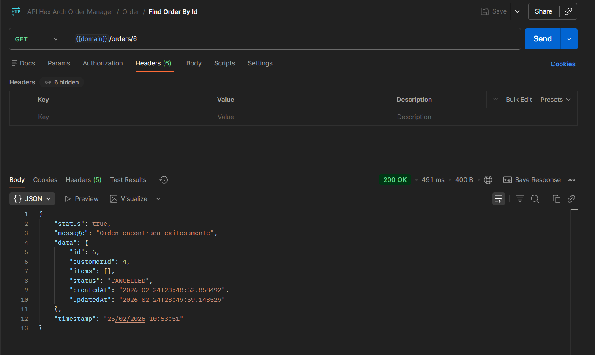
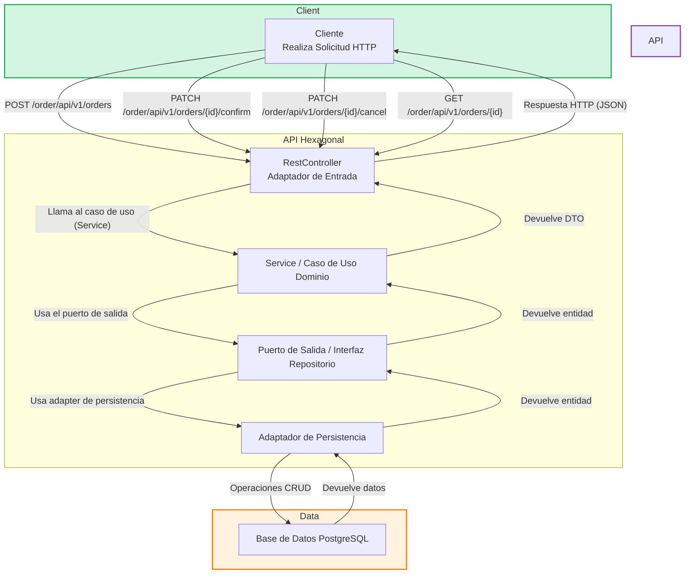

# ♨️ Ejercicio Práctico: ORDER MANAGER 🛍️

## Ejercicio Práctico IAS — JAVA + Srping Boot + Arquitectura Hexagonal

Este proyecto es una **API RESTful** para un sistema de gestión de órdenes de compra llamado **"Order Manager"**.  
La API permite a los usuarios **crear órdenes**, **confirmarlas**, **cancelarlas** y **consultarlas**, cumpliendo todas
las reglas de negocio del dominio de órdenes de compra.

La arquitectura se basa en el patrón **Hexagonal (Ports & Adapters)**, enfatizando la **separación de responsabilidades**,
estricta aplicación de **principios SOLID** y **Clean Code**.

**_Autor: Saul Echeverri_**   
_Edición: 2026_



## Comenzando 🚀

El objetivo central es demostrar la implementación de un microservicio robusto y desacoplado, aplicando **Arquitectura
Hexagonal**, principios SOLID, y Clean Code en Java 17 + Spring Boot 3.

Este repositorio es de carácter **educativo** y de práctica profesional, para entender y aplicar la gestión de órdenes
desacoplada de infraestructura, usando **JUnit, Mockito, JaCoCo, Gradle, PostgreSQL** y buenas prácticas de pruebas
unitarias.


---

## 1. REQUISITOS DEL SISTEMA ⚙️

Para ejecutar este proyecto, necesitas tener instalados los siguientes componentes:

### Instalación 🔧

A continuación, se describen los pasos para configurar y ejecutar este microservicio Java en tu entorno de desarrollo.

#### Requisitos Previos

Antes de comenzar, asegúrate de tener los siguientes requisitos previos en tu sistema:

- **IntelliJ IDEA** (u otro IDE compatible con Java)
- **Java Development Kit (JDK):** 17 o
  superior ([Oracle](https://www.oracle.com/java/technologies/javase-downloads.html)
  o [OpenJDK](https://adoptopenjdk.net/))
  Para verificar si Java está instalado, puedes abrir una terminal y ejecutar el siguiente comando:

```shell
  java -version
   ```

- **Conexión a Internet** para descargar dependencias vía Gradle
- **Gradle** como gestor de dependencias ([Gradle](https://gradle.org/))
- **PostgreSQL:** Gestor de Bases de Datos   ([PostgreSQL](https://www.postgresql.org/))
- **Spring Boot 3**: El framework utilizado para construir la aplicación. No se requiere una instalación separada,
  ya que las dependencias se gestionan a través de Gradle.
- **Lombok**: Una biblioteca que reduce el código repetitivo (por Gradle).
- **JaCoCo Maven Plugin**: El plugin de Gradle para generar reportes de cobertura de código. Su configuración está
  incluida en el `build.gradle`.
- **Git**: instalalo en su sitio oficial [Git](https://git-scm.com/) si deseas clonar el repositorio.

#### Clonar el Repositorio

Para comenzar, clona este repositorio en tu máquina local usando Git:

```shell
  git clone https://github.com/saulolo/order-manager
```

## Despliegue 📦

En esta sección, se proporcionan instrucciones y notas adicionales sobre cómo llevar el proyecto a un entorno de
desarrollo o cómo desplegarlo para su uso.

### Despliegue Local 🏠

Si deseas ejecutar tu proyecto en tu propio entorno local para pruebas o desarrollo, sigue estos pasos generales:

1. **Configura PostgreSQL**: Asegúrate de tener una base de datos PostgreSQL funcionando. Crea una base de datos con
   el nombre `db_order_manager` y las tablas usando `db/01_Tables.sql)`

**Instrucciones para ejecutarlo desde DBeaver (PostgreSQL):**

- Abre DBeaver y conéctate al servidor de PostgreSQL.
- Crea la base de datos asi:
    - Haz clic derecho sobre el servidor > **Create > Database**
    - Nómbrala: `db_order_manager`
    - Haz clic derecho sobre la nueva base de datos > **SQL Editor > Open SQL Script**
    - Copia y pega el contenido del archivo `01_Tables.sql` o ábrelo desde el explorador con `File > Open File`.
    - Ejecuta el script completo haciendo clic en el botón ▶️ o presionando `Ctrl + Enter`.

**Configuración de Variables de Entorno**: Tu sistema debe de teenr configuradas las variables de entorno JAVA_HOME,
PATH para que apunten a tu instalación de JDK y credenciales para la base de datos.

3. **Configuración del** `application.properties`: Edita el archivo `src/main/resources/application.properties` para
   configurar la conexión a la base de datos PostgreSQL, asegurate de usar el puerto `8086` y la ruta base
   `/order/api/v1`
   para la aplicación, según los requisitos.

```properties
spring.datasource.url=jdbc:postgresql://localhost:5432/db_order_manager
spring.datasource.username=tu_usuario
spring.datasource.password=tu_contraseña
```

4. **Compilación y Ejecución**: Para compilar y ejecutar el proyecto localmente usando Gradle ejecuta el siguiente
   comando:

```shell
  ./gradlew clean build
```

5. **Ejecución**: Ejecutar la clase principal `OrderManagerApplication`.
   La API estará disponible en la ruta `http://localhost:8086/order/api/v1/`.

---

## 2. ESTRUCTURA DEL PROYECTO 🏗️

El proyecto sigue una **Arquitectura Hexagonal** para organizar las responsabilidades de cada clase, lo que facilita
el mantenimiento y la escalabilidad.

```ja
order-manager/
├── src/
│   ├── main/
│   │   ├── java/
│   │   │   └── edu.ordermanager/
│   │   │       ├── application.service/
│   │   │       ├── common/
│   │   │       │   ├── constants/
│   │   │       │   └── utils/
│   │   │       ├── domain/
│   │   │       │   ├── enums/
│   │   │       │   ├── exception/
│   │   │       │   ├── model/
│   │   │       │   └── port/
│   │   │       │       ├── in/
│   │   │       │       └── out/
│   │   │       ├── infrastructure/
│   │   │       │   ├── adapter/
│   │   │       │   │   ├── in.rest/
│   │   │       │   │   │   ├── controller.dto/
│   │   │       │   │   │   ├── handler/
│   │   │       │   │   │   └── mapper/
│   │   │       │   │   └── out.persistence.jpa/
│   │   │       │   │       ├── entity/
│   │   │       │   │       ├── exception/
│   │   │       │   │       ├── mapper/
│   │   │       │   │       └── repository/
│   │   │       │   │           ├── CustomerJpaRepositoryAdapter
│   │   │       │   │           ├── OrderJpaRepositoryAdapter
│   │   │       │   │           └── ProductJpaRepositoryAdapter
│   │   │       │   ├── config/
│   │   │       │   └── exception/
│   │   │       └── OrderManagerApplication
│   │   └── resources
│   │       └── application.properties
│   └── test/
└── build.gradle
```

- **Adapters:** Implementan los puertos definidos por el dominio.
- **Application/Service:** Casos de uso desacoplados (no dependen de frameworks).
- **Domain/Model:** Entidades y lógica de negocio, sin dependencias externas ni JPA.
- **Port:** Interfaces para entrada y salida (“in” y “out”).
- **Common:** Constantes de error, utilidades, config.
- **Test:** Pruebas unitarias (alto coverage; ver Jacoco).
- **Infrastructure:** Implementa detalles técnicos que permiten la comunicación con herramientas externas.

---

## 3. ESPECIFICACIONES TÉCNICAS Y REQUERIMIENTOS 📋

El proyecto fue desarrollado siguiendo los siguientes requerimientos técnicos:

* **Arquitectura:** Hexagonal (Ports & Adapters). ✅
* **Principios SOLID**. ✅
* **Tipo de aplicación**: API RESTful. ✅
* **Dominio:** 100% desacoplado, sin dependencias a frameworks. ✅
* **Base de datos:** PostgreSQL (sin @Entity en dominio). ✅
* **Puerto:** 8086. ✅
* **Ruta base API:** `/order/api/v1`, ✅
* **Pruebas unitarias:** JUnit 5 + Mockito + JaCoCo (Cobertura > 50%). ✅
* **Validaciones:** API validations manuales/automáticas. ✅
* **Excepciones personalizadas:** En dominio y aplicación. ✅
* **Gestión de logs:** Slf4j en todas las transacciones clave. ✅
* **Mapping DTOs:** Manual, usando patrón builder. ✅
* **Configuración:** Variables de entorno, Banner personalizado, ✅
* **Entrega:** Scripts SQL ✅
* **Estructura de la respuesta**: ✅

```json
{
  "data": null,
  "status": "success",
  "message": ""
}
```

---

## 4. STACK DE DESARROLLO Y ARQUITECTURA 🛠️

El proyecto se construyó utilizando un conjunto de herramientas y frameworks modernos del ecosistema de Java, diseñados
para el desarrollo eficiente de aplicaciones web.

### Java y Spring Boot ☕

- **Java 17**: Se utiliza como el lenguaje de programación principal, aprovechando sus características más recientes
  para un código robusto y legible.
- **Spring Boot**: Es el framework que facilita la creación de aplicaciones web y microservicios, optimizando el tiempo 
de dearrollo. 
- **Gradle**: Es el framework que facilita la creación de aplicaciones web y microservicios, optimizando el tiempo
  de desarrollo a través de la autoconfiguración y el manejo de dependencias.
- **Lombok**: Librería que elimina código repetitivo (getters, setters) mediante anotaciones para mantener las clases
  limpias.

_**⚠️ NOTA IMPORTANTE**_: Use esta libreria en los POJO's (modelos) de la capa de dominio, y la razón es porque Lombok es una 
dependencia de compilación y su trabajo termina cuando el código JAVA se convierte en Bytecode, cuando esto sucede, se 
genera un archivo .class sin rastros de las anotaciones de lombok, es decir no rompe la regla arquitectónica ya que no 
le da al POJO ninguna información sobre cómo debe de interactuar con la BD o la web.

### Gestión de Datos y Persistencia 🗃️

- **PostgreSQL**: Es el sistema de gestión de bases de datos relacionales utilizado por el proyecto. Es conocido por
  su fiabilidad, robustez y cumplimiento de estándares SQL.
- **JPA (Java Persistence API)**: Es la especificación de Java para la persistencia de datos. Permite a los
  desarrolladores mapear objetos de Java a tablas de bases de datos relacionales.
- **Hibernate**: Es la implementación de JPA que actúa como el **ORM (Object-Relational Mapping)**. Se encarga de la
  comunicación entre la aplicación y la base de datos, simplificando las operaciones de lectura y escritura.

### Patrones de Diseño y Calidad de Código 👌

- **JUnit 5**: El framework de pruebas unitarias estándar para Java. Permite escribir y ejecutar pruebas para verificar
  el comportamiento del código.
- **Mockito**: Una biblioteca de mocking para Java. Se utiliza para crear objetos simulados (mocks) y así probar las
  clases de forma aislada sin depender de sus dependencias reales.
- **JaCoCo**: Un *plugin* de cobertura de código. Genera reportes que muestran qué partes del código están siendo
  probadas y cuáles no, ayudando a alcanzar el objetivo de un **50% de cobertura**.
- **DTOs (Data Transfer Objects)**: Los DTOs son objetos que encapsulan datos para ser transferidos entre las capas de
  la aplicación, como del controlador al servicio. Este patrón permite desacoplar las entidades de la base de datos de
  la
  capa de la API, evitando exponer la estructura interna de la base de datos y manteniendo un contrato de API limpio y
  seguro.
- **Mappers**: Son clases o componentes que se encargan de convertir objetos de un tipo a otro, como de una entidad a
  un DTO. Utilizar mappers centraliza la lógica de conversión, haciendo el código más mantenible y legible.
- **Excepciones Personalizadas**: El proyecto implementa excepciones personalizadas para gestionar errores de forma
  clara y controlada. Esto permite que la API devuelva mensajes de error específicos y amigables, mejorando la
  experiencia
  del desarrollador que consume el servicio y la robustez de la aplicación.

### 📊 Diagrama de Flujo — Arquitectura Hexagonal



**Explicación:**

- **Capa de Entrega (Delivery):** Cliente interactúa vía HTTP → Puerto de entrada.
- **Núcleo de Dominio:** Puerto de entrada/casos de uso → lógica de dominio (entidad Order, reglas, validaciones) →
  puerto de salida.
- **Infraestructura:** Adapter de salida implementa el puerto de salida, accede a la DB (persistencia), devuelve
  resultados.
- **El flujo es de afuera hacia adentro, como exige la arquitectura hexagonal.**
- **La inversión de dependencias:** La infraestructura depende del dominio, nunca al revés.

### Flujo de la API 🚀

1. **Cliente** envía una solicitud HTTP (`POST`, `PATCH`, `GET`) al endpoint correspondiente.
2. **RestController** recibe la solicitud y la delega al caso de uso relevante.
3. **Service / Caso de Uso** aplica las reglas de negocio y opera sobre el modelo dominio.
4. **Puerto de Salida** abstrae el acceso a datos, separando el dominio de la infraestructura.
5. **Adaptador de Persistencia** realiza las operaciones CRUD contra PostgreSQL.
6. **Resultados** se devuelven hacia el caso de uso, el controlador y finalmente al cliente en formato
   estándar `{ data, status, message }`.

### Resumen del Flujo del Proceso de la API Hexagonal ➡️

`Cliente` ➡️ `RestController` ➡️ `Caso de Uso (Service)` ➡️ `Puerto de Salida` ➡️ `Adaptador de Persistencia`
➡️ `PostgreSQL` ➡️ `Adaptador de Persistencia` ➡️ `Puerto de Salida` ➡️ `Caso de Uso (Service)` ➡️ `RestController`
➡️ `Cliente`

### Métodos y Clases Principales de la API de Java en el Proyecto 𝄜

| Clase                                                             | Principales Métodos                                            | Descripción                                                                                  |
|:------------------------------------------------------------------|:---------------------------------------------------------------|:---------------------------------------------------------------------------------------------|
| **edu.ordermanager.adapter.in.rest.OrderController**              | `createOrder(), getOrderById(), confirmOrder(), cancelOrder()` | Expone los endpoints RESTful para gestionar órdenes (crear, consultar, confirmar, cancelar). |
| **edu.ordermanager.application.service.CreateOrderService**       | `createOrder()`                                                | Implementa la lógica de negocio para crear una nueva orden.                                  |
| **edu.ordermanager.application.service.GetOrderService**          | `getOrderById()`                                               | Implementa la lógica para consultar una orden por su ID.                                     |
| **edu.ordermanager.application.service.UpdateOrderStatusService** | `confirmOrder(), cancelOrder()`                                | Implementa la lógica para confirmar o cancelar órdenes según reglas del dominio.             |
| **edu.ordermanager.domain.port.out.OrderRepository**              | `findById(), save(), update()`                                 | Define contrato para acceso a datos de órdenes, implementado por adaptadores de salida.      |
| **org.mockito.Mockito**                                           | `when(), any(), verify()`                                      | Utilizado en pruebas unitarias para simular comportamientos y verificar interacciones.       |
| **org.junit.jupiter.api.Test**                                    | `@Test`                                                        | Anotación estándar para métodos de prueba unitaria en JUnit 5.                               |

---

## Autor ✒️

¡Hola! Soy **Saul Echeverri Duque** 👨‍💻 , el creador y desarrollador de este proyecto. Permíteme compartir un poco sobre
mi
formación y experiencia:

### Formación Académica 📚

- 🎓 Graduado en Ingeniería de Alimentos por la Universidad de Antioquia, Colombia.
- 📖 Titulado en Tecnología en Análisis y Desarrollo de Software por el SENA.

### Trayectoria Profesional 💼

- 👨‍💻 Cuento con dos años de experiencia laboral en el campo del desarrollo de software.
- 🌟 Durante mi trayectoria, he tenido el privilegio de trabajar en diversos proyectos tecnológicos, donde he aplicado
  mis conocimientos en programación y análisis.
- 🏢 Actualmente, formo parte de [IAS Software](https://www.ias.com.co/), una empresa de software en Medellín, Colombia,
  donde sigo creciendo profesionalmente y contribuyendo al mundo de la tecnología.

### Pasión por la Programación 🚀

- 💻 Mi viaje en el mundo de la programación comenzó en el 2021, y desde entonces, he estado inmerso en el emocionante
  universo del desarrollo de software.
- 📚 Uno de mis mayores intereses y áreas de enfoque es el uso de tecnologías del **Backend** y el **cloud engineering**, 
y este proyecto es el resultado de mi deseo de compartir conocimientos y experiencias relacionadas con este lenguaje y 
algunas de estas herramiemtas. 
- 🤝 Estoy emocionado de colaborar y aprender junto a otros entusiastas de este rubro.

Estoy agradecido por la oportunidad de realizar y compartir este proyecto y espero que te sea útil en tu propio camino de
aprendizaje y desarrollo asi como lo hizo conmigo. Si tienes alguna pregunta, sugerencia o simplemente quieres charlar 
sobre tecnología, no dudes en ponerte en contacto conmigo. ¡Disfruta explorando el mundo de la Tecnología!


## Licencia 📄

Este proyecto es un ejercicio técnico aplicativo creado para **IAS Software**. Por lo tanto, su uso y distribución están
restringidos y regulados por los términos de dicha empresa.

Cualquier uso, reproducción o distribución del contenido de este proyecto con fines comerciales o fuera del alcance de
la prueba técnica debe ser autorizado explícitamente por IAS Software. Se agradece respetar los derechos de autor y la
propiedad intelectual de la compañía.

**Nota Importante**: Este proyecto no se distribuye bajo una licencia de código abierto estándar, ya que está destinado
principalmente para fines personales y educativos. Si deseas utilizar o distribuir el contenido de este proyecto más
allá de los fines educativos personales, asegúrate de obtener los permisos necesarios del autor.

Es importante respetar los derechos de autor y las restricciones legales asociadas con el contenido del mismo.

## Expresiones de Gratitud 🎁

Quiero expresar mi más sincero agradecimiento a [IAS Software](https://www.ias.com.co/) y a su unidad de formación liderado por el ingeniero 
**Manuel Cuevas**, por compartir su tiempo y conocimiento técnico.

Este proyecto me ha permitido aplicar y expandir mis conocimientos en el desarrollo de APIs aplicando la 
**Arquitectura Hexagonal** y en la metodología de pruebas de software, fortaleciendo mis habilidades en tecnologías con 
Java y Spring Boot. La experiencia ha sido invaluable para mi crecimiento profesional.

Si encuentras este proyecto útil y te gustaría expresar tu gratitud de alguna manera, aquí hay algunas opciones:

* Comenta a otros sobre este proyecto 📢: Compartelo con tus amigos, colegas o en tus redes sociales para
  que otros también puedan beneficiarse de él.

* Invita una cerveza 🍺 o un café ☕ a alguien del equipo: Siéntete libre de mostrar tu aprecio por el esfuerzo del
  autor o del único miembro del equipo (yo) comprándoles una bebida virtual.

* Da las gracias públicamente 🤓: Puedes expresar tu agradecimiento públicamente en el repositorio del proyecto, en los
  comentarios, o incluso en tu blog personal si lo deseas.

¡Gracias por ser parte de este viaje de aprendizaje y desarrollo!

## Créditos 📜

Este proyecto fue desarrollado con ❤️ por [Saul Echeverri](https://github.com/saulolo) 😊.

Si tienes preguntas, comentarios o sugerencias, no dudes en ponerte en contacto conmigo:

- GitHub: [https://github.com/saulolo](https://github.com/saulolo) 🌐
- Correo Electrónico: [saulolo@gmail.com](saulolo@gmail.com) 📧
- LinkedIn: [https://www.linkedin.com/in/saul-echeverri-duque/](https://www.linkedin.com/in/saul-echeverri-duque/) 💼

---

### METADATOS DEL DOCUMENTO 📄

| Campo                    | Detalles                                                                                                                        |
|:-------------------------|:--------------------------------------------------------------------------------------------------------------------------------|
| **Título**               | EJERCICIO PRÁCTICO: ORDER MANAGER                                                                                               |
| **Autor(es)**            | Saul Echeverri                                                                                                                  |
| **Versión**              | 1.0.0                                                                                                                           |
| **Fecha de Creación**    | 25 de Febrero de 2026                                                                                                           |
| **Última Actualización** | 25 de Febrero de 2026                                                                                                           |
| **Notas Adicionales**    | Documento base para referencia rápida de una API RESTful para la gestión de ordenes de compra aplicando Arquitectura Hexagonal. |

---
